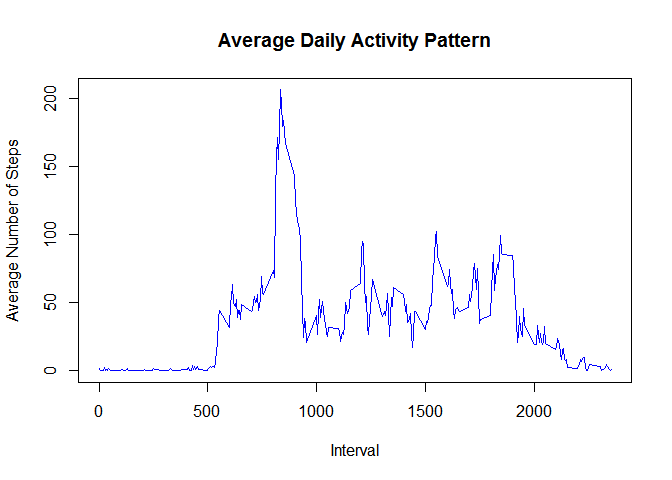

Introduction
------------

It is now possible to collect a large amount of data about personal
movement using activity monitoring devices such as a Fitbit, Nike
Fuelband, or Jawbone Up. These type of devices are part of the
“quantified self” movement – a group of enthusiasts who take
measurements about themselves regularly to improve their health, to find
patterns in their behavior, or because they are tech geeks. But these
data remain under-utilized both because the raw data are hard to obtain
and there is a lack of statistical methods and software for processing
and interpreting the data.

This assignment makes use of data from a personal activity monitoring
device. This device collects data at 5 minute intervals through out the
day. The data consists of two months of data from an anonymous
individual collected during the months of October and November, 2012 and
include the number of steps taken in 5 minute intervals each day.

Loading and preprocessing the data
----------------------------------

    #Reading data
    d <- read.csv("C:/Users/Ayush Bhargava/Desktop/Data science/Coursera/Reproducible Research/week2 Assignment/repdata%2Fdata%2Factivity/activity.csv",stringsAsFactors=FALSE)

    #Explore data
    str(d)

    ## 'data.frame':    17568 obs. of  3 variables:
    ##  $ steps   : int  NA NA NA NA NA NA NA NA NA NA ...
    ##  $ date    : chr  "2012-10-01" "2012-10-01" "2012-10-01" "2012-10-01" ...
    ##  $ interval: int  0 5 10 15 20 25 30 35 40 45 ...

    #Transform data
    d$date <- as.Date(d$date)
    d$interval <- factor(d$interval)

What is mean total number of steps taken per day?
-------------------------------------------------

### total number of steps taken per day

    x <- with(d,tapply(steps,as.factor(date),sum,na.rm=T))
    x

    ## 2012-10-01 2012-10-02 2012-10-03 2012-10-04 2012-10-05 2012-10-06 
    ##          0        126      11352      12116      13294      15420 
    ## 2012-10-07 2012-10-08 2012-10-09 2012-10-10 2012-10-11 2012-10-12 
    ##      11015          0      12811       9900      10304      17382 
    ## 2012-10-13 2012-10-14 2012-10-15 2012-10-16 2012-10-17 2012-10-18 
    ##      12426      15098      10139      15084      13452      10056 
    ## 2012-10-19 2012-10-20 2012-10-21 2012-10-22 2012-10-23 2012-10-24 
    ##      11829      10395       8821      13460       8918       8355 
    ## 2012-10-25 2012-10-26 2012-10-27 2012-10-28 2012-10-29 2012-10-30 
    ##       2492       6778      10119      11458       5018       9819 
    ## 2012-10-31 2012-11-01 2012-11-02 2012-11-03 2012-11-04 2012-11-05 
    ##      15414          0      10600      10571          0      10439 
    ## 2012-11-06 2012-11-07 2012-11-08 2012-11-09 2012-11-10 2012-11-11 
    ##       8334      12883       3219          0          0      12608 
    ## 2012-11-12 2012-11-13 2012-11-14 2012-11-15 2012-11-16 2012-11-17 
    ##      10765       7336          0         41       5441      14339 
    ## 2012-11-18 2012-11-19 2012-11-20 2012-11-21 2012-11-22 2012-11-23 
    ##      15110       8841       4472      12787      20427      21194 
    ## 2012-11-24 2012-11-25 2012-11-26 2012-11-27 2012-11-28 2012-11-29 
    ##      14478      11834      11162      13646      10183       7047 
    ## 2012-11-30 
    ##          0

### Make a histogram of the total number of steps taken each day

    hist(x, breaks = 20, col = "red", xlab = "Number of Steps", main= "Histogram of the total number of steps taken each day(without imputed values")

### mean and median of the total number of steps taken per day

    mean(x)

    ## [1] 9354.23

    median(x)

    ## [1] 10395

What is the average daily activity pattern?
-------------------------------------------

### time series plot (i.e. type = "l") of the 5-minute interval (x-axis) and the average number of steps taken, averaged across all days (y-axis)

    #calculating aggregate steps for each interval
    y <- with(d,aggregate(steps,list(interval=interval),mean,na.rm=T))

    #column names for the new data frame
    colnames(y) <- c("interval", "average_steps")

    #Ploting the required plot
    plot(y$average_steps~levels(y$interval), type="l",xlab = "Interval", ylab = "Average Number of Steps", main = "Average Daily Activity Pattern",  col ="blue")

### Which 5-minute interval, on average across all the days in the dataset, contains the maximum number of steps?

    y[which(y$average_steps==max(y$average_steps)),1]

    ## [1] 835
    ## 288 Levels: 0 5 10 15 20 25 30 35 40 45 50 55 100 105 110 115 120 ... 2355

Imputing missing values
-----------------------

### Calculate and report the total number of missing values in the dataset (i.e. the total number of rows with NAs)

    sum(is.na(d$steps))

    ## [1] 2304

    sum(is.na(d$date))

    ## [1] 0

    sum(is.na(d$interval))

    ## [1] 0

### Devise a strategy for filling in all of the missing values in the dataset. The strategy does not need to be sophisticated. For example, you could use the mean/median for that day, or the mean for that 5-minute interval, etc.

we will impute mean value of steps for intervals whereever data is
missing \#\#\#Create a new dataset that is equal to the original dataset
but with the missing data filled in.

    #creating vector z with NAs replaced 
    z <- NULL
    for (i in 1:nrow(d)){
    if(is.na(d$steps[i])){
    z[i]<-y$average_steps[which(y$interval==d$interval[i])]
    }
    else{z[i]<-d$steps[i]}
    }

    #adding z to the data set
    d$steps <- z

    #checking the dataset
    head(d)

    ##       steps       date interval
    ## 1 1.7169811 2012-10-01        0
    ## 2 0.3396226 2012-10-01        5
    ## 3 0.1320755 2012-10-01       10
    ## 4 0.1509434 2012-10-01       15
    ## 5 0.0754717 2012-10-01       20
    ## 6 2.0943396 2012-10-01       25

    #checking if imputation worked 
    sum(is.na(d$steps))

    ## [1] 0

### histogram of the total number of steps taken each day(with imputed values)

    x <- with(d,tapply(steps,as.factor(date),sum,na.rm=T))
    hist(x, breaks = 20, col = "red", xlab = "Number of Steps", main= "Histogram of the total number of steps taken each day(with imputed values")

### Effect of imputation of total steps per day

    x

    ## 2012-10-01 2012-10-02 2012-10-03 2012-10-04 2012-10-05 2012-10-06 
    ##   10766.19     126.00   11352.00   12116.00   13294.00   15420.00 
    ## 2012-10-07 2012-10-08 2012-10-09 2012-10-10 2012-10-11 2012-10-12 
    ##   11015.00   10766.19   12811.00    9900.00   10304.00   17382.00 
    ## 2012-10-13 2012-10-14 2012-10-15 2012-10-16 2012-10-17 2012-10-18 
    ##   12426.00   15098.00   10139.00   15084.00   13452.00   10056.00 
    ## 2012-10-19 2012-10-20 2012-10-21 2012-10-22 2012-10-23 2012-10-24 
    ##   11829.00   10395.00    8821.00   13460.00    8918.00    8355.00 
    ## 2012-10-25 2012-10-26 2012-10-27 2012-10-28 2012-10-29 2012-10-30 
    ##    2492.00    6778.00   10119.00   11458.00    5018.00    9819.00 
    ## 2012-10-31 2012-11-01 2012-11-02 2012-11-03 2012-11-04 2012-11-05 
    ##   15414.00   10766.19   10600.00   10571.00   10766.19   10439.00 
    ## 2012-11-06 2012-11-07 2012-11-08 2012-11-09 2012-11-10 2012-11-11 
    ##    8334.00   12883.00    3219.00   10766.19   10766.19   12608.00 
    ## 2012-11-12 2012-11-13 2012-11-14 2012-11-15 2012-11-16 2012-11-17 
    ##   10765.00    7336.00   10766.19      41.00    5441.00   14339.00 
    ## 2012-11-18 2012-11-19 2012-11-20 2012-11-21 2012-11-22 2012-11-23 
    ##   15110.00    8841.00    4472.00   12787.00   20427.00   21194.00 
    ## 2012-11-24 2012-11-25 2012-11-26 2012-11-27 2012-11-28 2012-11-29 
    ##   14478.00   11834.00   11162.00   13646.00   10183.00    7047.00 
    ## 2012-11-30 
    ##   10766.19

Some days have "0" steps when NAs were ignored now these days have some
values \#\#\#Effect of imputation on mean and median

    mean(x)

    ## [1] 10766.19

    median(x)

    ## [1] 10766.19

mean and median also increased \#\#Are there differences in activity
patterns between weekdays and weekends? \#\#\#Create a new factor
variable in the dataset with two levels – “weekday” and “weekend”
indicating whether a given date is a weekday or weekend day.

    d$week <- ifelse(weekdays(d$date) %in% c("Saturday", "Sunday"), "weekend", "weekday")
    d$week <- factor(d$week)

### Make a panel plot containing a time series plot (i.e. type = "l") of the 5-minute interval (x-axis) and the average number of steps taken, averaged across all weekday days or weekend days (y-axis).

    t<-aggregate(steps~interval+week,d,mean)
    library(lattice)
    xyplot(steps ~  interval | week, data = t, layout = c(1,2), type ="l", ylab="Number of Steps")

weekends seem to have more uniformly distributed of activity than
weekdays
